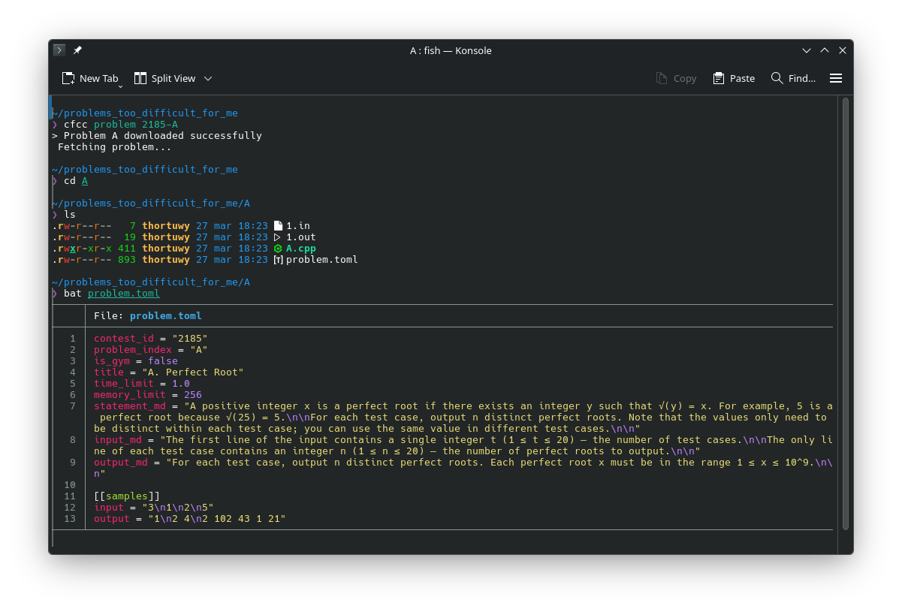
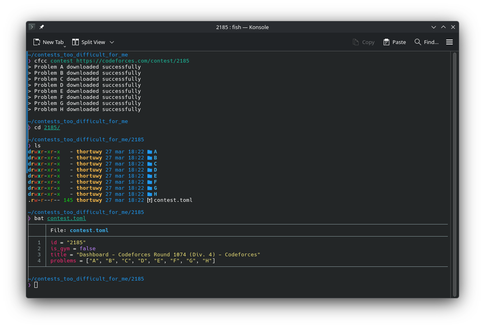
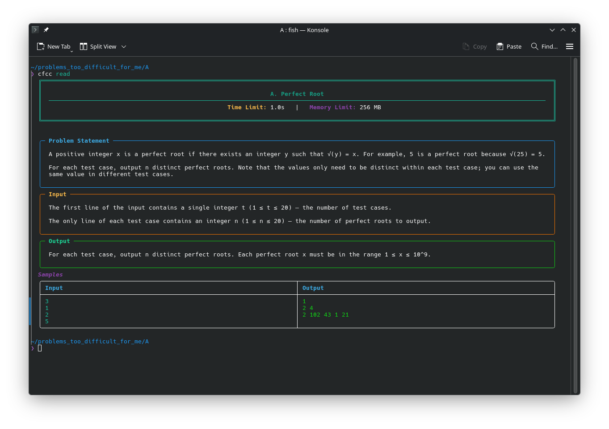
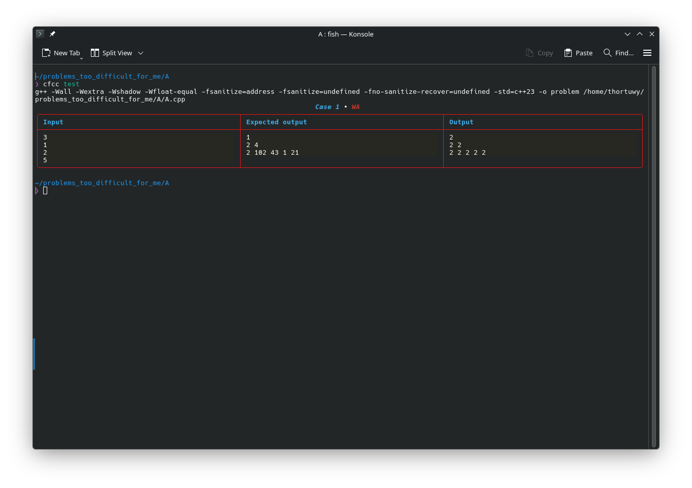
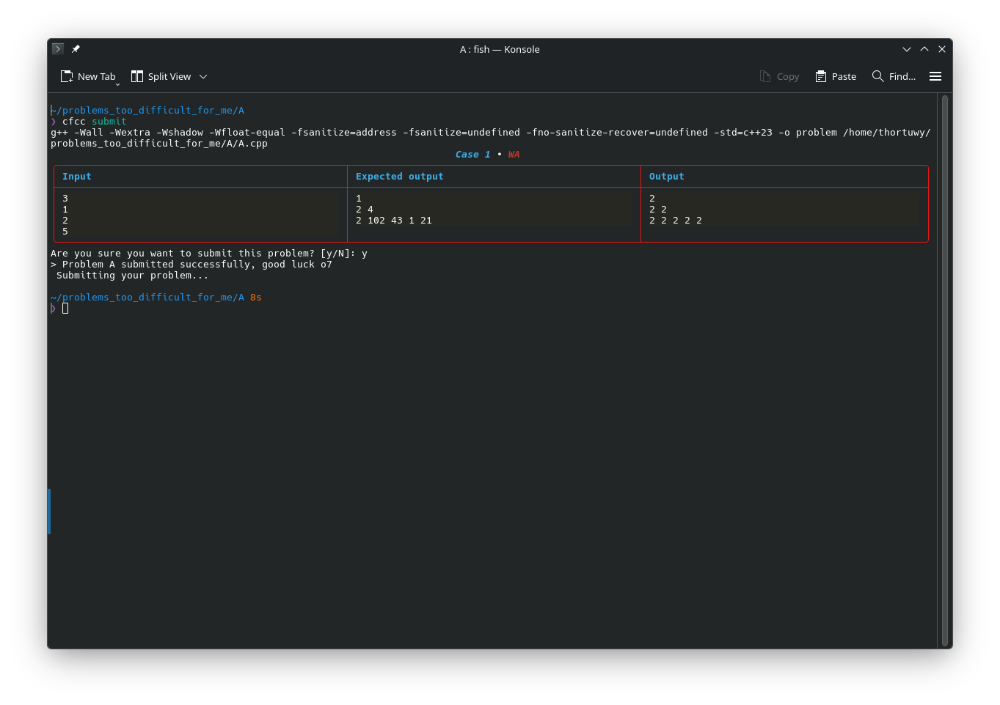
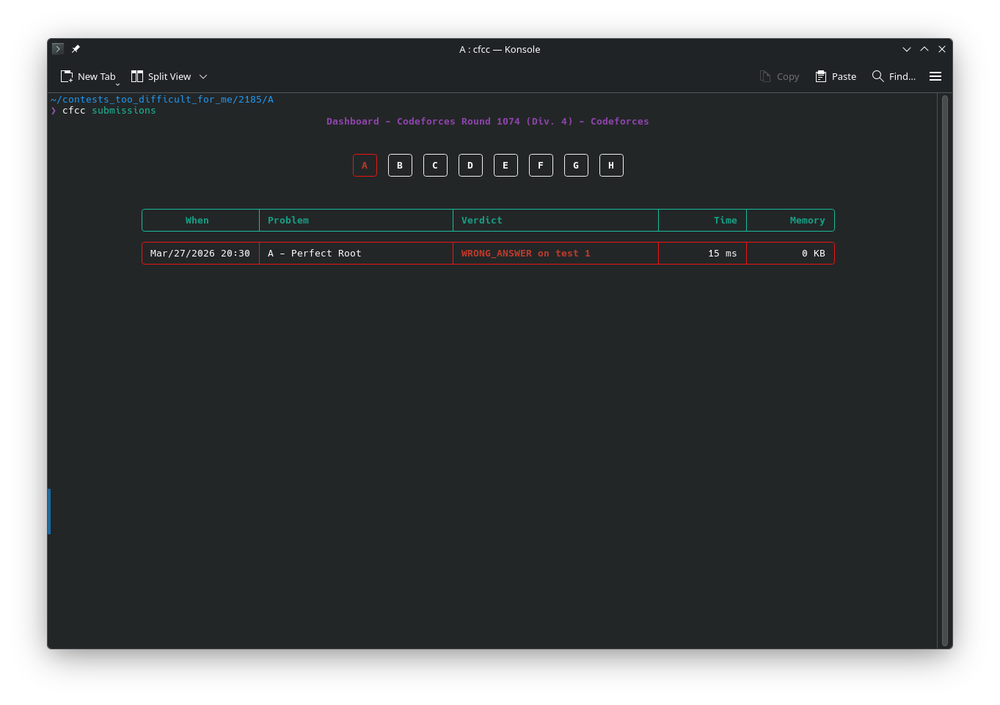
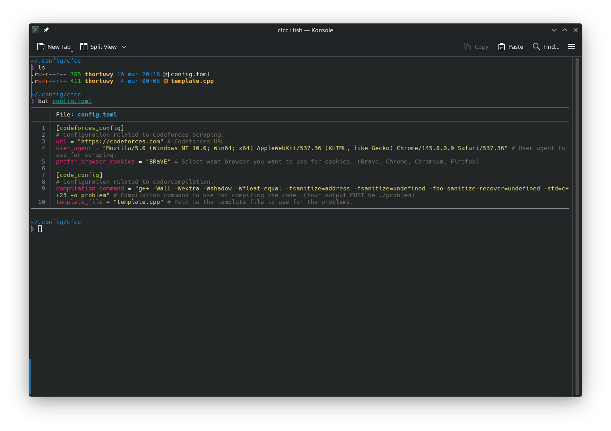

# CFCC (CodeForces Cool CLI)

You want to do codeforces, but you are scared to leave your amazing terminal???
Don't worry, because with this CLI you could achieve your dreams^.

^You need to still login into codeforces with your browser, upsis.

## How to install
<sub><sup>Nobody likes repo install, but it is too green for pip sooooorry</sub></sup>

To install it, first start by cloning the repo:
```bash
git clone https://github.com/ThorTuwy/cfcc
```

Now, assuming that you have installed [UV](https://docs.astral.sh/uv/getting-started/installation/)
(I didn't mention before, to give you a sunken cost fallacy because I am a bad person :P ), run this command:
```bash
uv tool install .
```

And now you NEED to enjoy using this CLI thing.

**WARNING**: Configs are generated after running your first command, so do that pls.


## Features 😎
<sub><sup>It isn't an AI emoji pls trust me</sub></sup>

And not joking, as you have all what you need here:

* Download problems using `cfcc problem ID/URL`

* Download entire contest using `cfcc contest ID/URL`

* Read your problems in tour beautiful terminal using: `cfcc read`

* Test your solutions with `cfcc test`

* Submit your solutions with `cfcc submit`

* See your submission in realtime with `cfcc submissions`

* AND change the configuration using a simply TOML `HOME/.config/cfcc/`


## General idea
<sub><sup>Zzz text for Zzz mans</sub></sup>

The main idea of this project is provide a CLI app in which you can (mostly)
forget about the stupid browser and focus simply on your terminal to reduce
mental noise, in part with that, the commands need to be stupidly easy to use
so is not need it to be thinking what you should do, and also I don't want
and BIG dependency on the project as is a little lame ngl.

For that I decided on this way of working: This CLI is path aware, so the
idea is that when you download a contest/problem, when you are inside a problem
folder, you are going to be able to use commands as `cfcc read` or `cfcc submit`
without having to put paths or things like that. Also instead of getting the cookies
via a headless browser or some shit like that (Because Cloudflare protection not possible
to simply log in with using plain request), I simply scrap the cookies of your current 
browser (Thx to browser_cookie3).

## PROBLEMS!?!?!
<sub><sup>In my project??? I am perfect^ so impossible that is my fault</sub></sup>

If you need your favourite feature to be implemented or help fixing 
that annoying bug, simply open your own issue or PR (But know
that may or may not read it :P)


